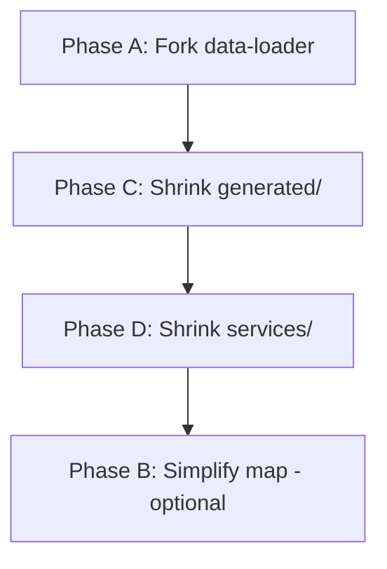

# NBA Hackathon — Cleanup Plan

## Goal
Hapus semua file yang nggak dipake NBA runtime dari bundle, termasuk shared infrastructure yang cuma ikut karena import chain.

## Current Problem
NBA variant early-return di `loadAllDataNba()` sih udah, tapi Vite tetep resolve semua import di:
- `data-loader.ts` → semua services → semua config
- `DeckGLMap.ts` / `GlobeMap.ts` / `MapContainer.ts` → geo, pipa, irradiators, dll.
- `src/generated/` → 30 service client + server definitions

## Approach

### Phase A: Fork data-loader (HIGH effort, HIGH risk)
Buat `data-loader-nba.ts` baru yang cuma import NBA-relevant services:

| Current data-loader.ts | NbaDataLoader |
|------------------------|---------------|
| Import 48 services | Import ~5 services (prediction-market, client, automation-engine) |
| Import semua config | Import config/variant, config/feeds aja |
| Load NBA → early return | Langsung NBA-only |

**Risiko:** event-handlers.ts, App.ts, panel-layout.ts semua pake data-loader. Nama class/API harus sama persis.

### Phase B: Simplify map components (HIGH risk)
Buat `NbaMapContainer.ts`, `NbaDeckGLMap.ts` tanpa:
- Import geo, pipa, irradiators, ai-datacenters
- Import generated server types
- Layer definitions non-NBA

**Risiko:** map rendering bakal beda, banyak edge case.

### Phase C: Shrink generated/ (MEDIUM effort)
Hapus dir `src/generated/client/{climate,conflict,cyber,...}` yang nggak dipake:
1. Cek tiap dir dipakai apa nggak (udah: semua dipakai)
2. Tapi data-loader baru gak perlu 90% dari ini
3. Generated server — cek apa dipakai selain gateway.ts & vite.sebuf-plugin.ts

**Risiko:** kalau ada komponen yang masih import, error.

### Phase D: Shrink services/ (MEDIUM effort)
47 dari 49 services dipakai data-loader lama. Kalau Phase A done, mayoritas bisa dihapus:
- Keep: prediction-market, client, automation-engine, dega-rank, canon-bridge, server-api
- Plus ~5 shared infra: storage, i18n, runtime, font-settings, meta-tags
- Hapus ~40 services

## Execution Order

## Risk Matrix

| Phase | Effort | Risk | Value |
|-------|--------|------|-------|
| A | 3-5 jam | High | Reduces bundle ~70% |
| B | 2-3 jam | Very High | Minor extra reduction |
| C | 1 jam | Medium | Clean generated/ dir |
| D | 2-3 jam | Medium-High | Clean services/ dir |

## Verdict

**Rekomendasi:** Skip buat hackathon. 10MB bundle is fine untuk demo — loading time gak beda signifikan. Resiko fork data-loader + map components tinggi, apalagi submission deadline May 31.

**Kalau tetep mau jalan:** mulai dari Phase A (fork data-loader), test build, baru lanjut Phase C & D.
